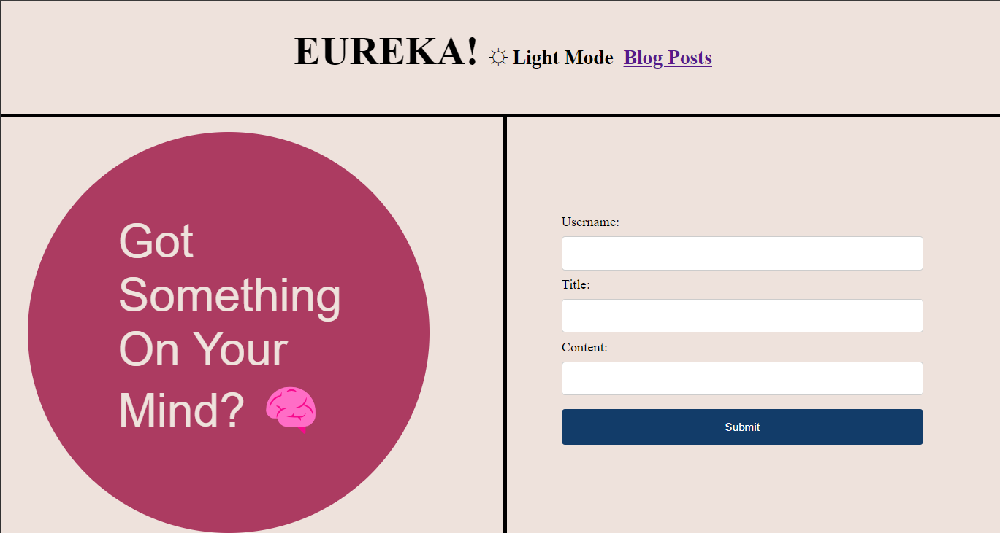

# personal-blog-board
## Description
A webpage that allows the user to create their own blog board with locally stored posts. It also allows you to toggle between a light and dark mode.

## Purpose
I creates this website to further hone my abilities and test my skills with local storage, media queries, CSS styling, and collectively everything in between. Given the knowledge I had at the time, I learned a lot about the possibilities of JavaScript and am excited to work more with it!

## Installation
Simply open up the deployed GitHub URL:
https://kushonim.github.io/personal-blog-board/

## Screen Shot

## Author
Austin Lee
GitHub: @Kushonim

## License
MIT License
